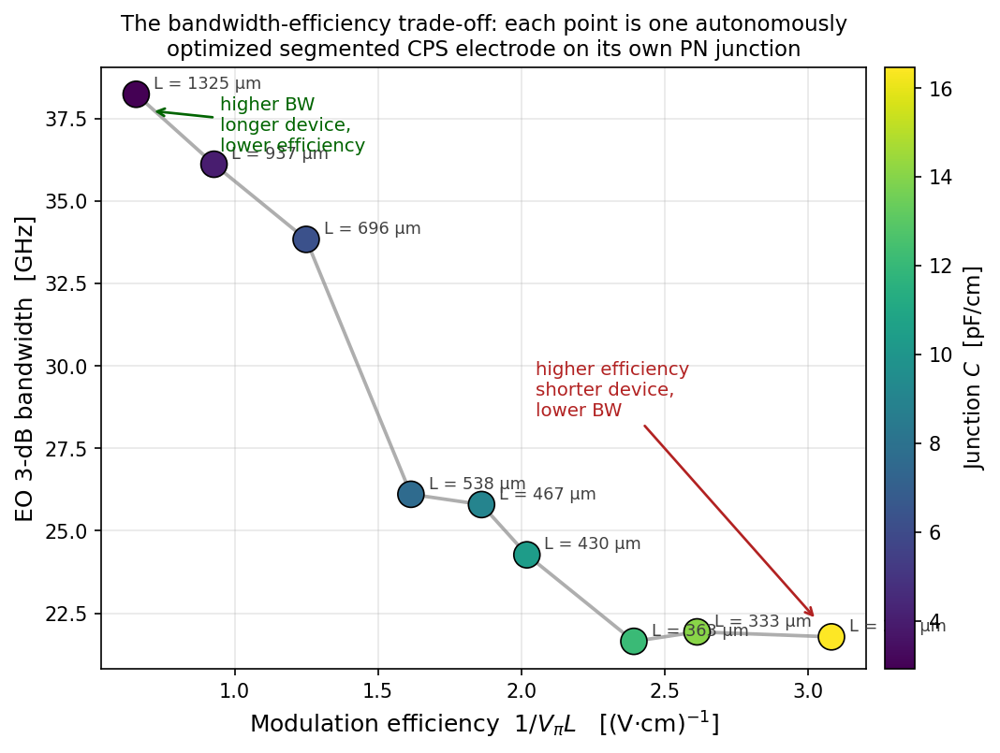

# Designing Ten Modulators Overnight: A Multi-Physics Agent in the Loop

We let an autonomous design agent run four coupled physics simulations — charge transport, optical mode, 3-D RF FDTD, and analytic loaded-line — in one closed loop to design ten silicon Mach–Zehnder modulators, each at a different operating point on the bandwidth-vs-efficiency frontier. Prior agentic-design demonstrations exercised one solver at a time; this run coordinates four of them across a single overnight session on Flexcompute's GPU-native multiphysics platform.


After ten of those Step-2 optimizations, the agent has ten complete modulators. The headline plot is the achievable bandwidth-vs-efficiency curve they trace out:




## Why a multi-physics agent here

The Mach–Zehnder modulator is one of the cleanest examples of a coupled
design problem in silicon photonics. The two datasheet numbers a customer
reads off — bandwidth and VπL — depend on a chain of four physics:

- **Charge transport** sets the junction capacitance C(V) and series
  resistance R(V) of the doped silicon.
- **Optical mode solving** sets VπL and propagation loss for that doping
  profile.
- **3-D RF electromagnetic simulation** sets the unloaded characteristic
  impedance Z₀, the RF group index n_eff_RF, and the conductor + dielectric
  loss of the metal electrode that drives the junction.
- **Analytic loaded-line + transfer-function** assembly folds C(V), R(V),
  Z₀, n_eff_RF, and α back together into an EO 3-dB bandwidth at a chosen
  device length and extinction ratio.

A single modulator design point is the output of all four. Earlier
autonomous-design demonstrations on this platform exercised these solvers
individually — [an agent exploring RF transmission-line topologies](https://hs.flexcompute.com/blog/rf-transmission-modulators),
[another running drift-diffusion + mode solves to sweep the junction
envelope](https://hs.flexcompute.com/blog/agentic-photonic-design-modulators),
and [a third routing electrical signals across a photonic chip under DRC
constraints](https://hs.flexcompute.com/blog/agentic-photonic-design-routing).
The new thing here is that all of them are in the same loop, with the
agent moving artifacts between them and keeping the geometry consistent.


## The loop

We split the problem into two stacked loops, sharing one journal:


**Step 1 (junction envelope).** A scalar `mult` scales both p- and n-core
doping around the nominal process values (p = 5×10¹⁷ cm⁻³,
n = 3×10¹⁷ cm⁻³ at `mult = 1`). The agent walks a bracket-and-fill
schedule with anchors at `mult ∈ {0.2, 1, 5, 20}` and inserts new mults at
the geometric midpoint of the largest gap on the (VπL, C) frontier. Each
mult costs one Tidy3D Charge run and one mode-solver batch over nine bias
points; ten mults cover the achievable cloud:


**Step 2 (electrode per operating point).** From the Step-1 journal, pick
ten capacitance values linearly spaced across the available range, and
for each one choose the Step-1 row with **minimum VπL within ±10 %** of
that C. Then, independently for each of the ten C-targets, run an
8-parameter Bayesian optimization on the segmented coplanar-strip
electrode:


The free parameters are the inner gap `g`, signal/ground rail widths
`ws`/`wg`, T-bar width/length `s`/`r`, T-neck length/width `h`/`t`, and
inter-T period gap `c`. The objective evaluates loaded characteristic
impedance and loaded RF group index at the band centre 25 GHz:

```
J = ((Re Z₀_loaded(f₀) − 50) / 50)² + ((n_eff_rf_loaded(f₀) − 3.88) / 3.88)²
```

Junction loading is applied *after* the FDTD via analytic ABCD arithmetic
on the cached Tidy3D S-parameters and the per-V (C, R) record from
Step 1. The 3.88 target is the optical group index — match it and the
optical and microwave waves co-propagate.


## DRC, generalized

Borrowing a frame from the [companion blog on autonomous photonic
routing](https://hs.flexcompute.com/blog/agentic-photonic-design-routing):
any rule the computer can check, geometric or physical, can be a
design-rule check. In this run the agent enforces three kinds before
ever billing a cloud simulation:

- **Fab rules** — the 8-parameter box bounds (`g ∈ [20, 250] μm`,
  `s ∈ [2, 25] μm`, …). BO proposals outside the box are rejected and
  resampled, costing nothing.
- **Process rules** — the heavy contact dopings (p⁺ = 1.5×10¹⁹, p⁺⁺ = 1×10²⁰,
  n⁺ = 1.2×10¹⁹, n⁺⁺ = 1×10²⁰ cm⁻³), the waveguide dimensions, and the
  dielectric stack are frozen. The agent can only move `mult` in Step 1
  and the eight electrode parameters in Step 2.
- **Sanity checks on the simulation setup** — a minimum feedline length
  of 300 μm so the wave port stays ≥2 mesh cells off the −y boundary
  (caught a Tidy3D `SetupError` mid-run before any FDTD was billed); a
  sign-flip check on the de-embedded RF group index (one candidate
  returned n_eff = −3.01, automatically retried with ±2 % perturbation
  and converged); a 1.2-GHz Gaussian smoother on the FDTD-extracted
  H(f) before the 3-dB crossing search (caught a single-point
  numerical ripple that would otherwise have reported a 21.6 GHz
  bandwidth instead of the true 23.9 GHz at one operating point).

In a manual workflow each of those would be a footnote in a postmortem;
here they are pre-conditions the agent applies before every cloud
submission.


## What the agent found

Nine distinct designs (operating point 8 picked the same junction as
operating point 7, since at that C the second-nearest row within
±10 % was the same row). Sorted by efficiency:

| C [pF/cm] | VπL [V·cm] | 1/VπL [(V·cm)⁻¹] | L_MZM [µm] | Z₀_loaded [Ω] | n_eff_RF | BW_3dB [GHz] |
|---:|---:|---:|---:|---:|---:|---:|
|  2.92 | 1.523 | 0.66 | 1325 | 49.3 | 3.70 | **38.3** |
|  4.01 | 1.078 | 0.93 |  937 | 48.3 | 4.20 | 36.0 |
|  6.27 | 0.800 | 1.25 |  696 | 38.6 | 4.66 | 33.8 |
|  7.62 | 0.619 | 1.61 |  538 | 32.0 | 4.55 | 26.1 |
|  9.02 | 0.537 | 1.86 |  467 | 30.7 | 4.88 | 25.8 |
| 10.35 | 0.495 | 2.02 |  430 | 27.8 | 5.05 | 24.2 |
| 12.11 | 0.418 | 2.39 |  363 | 26.3 | 5.31 | 23.9 |
| 14.07 | 0.383 | 2.61 |  333 | 22.4 | 5.36 | 21.9 |
| 16.47 | 0.324 | 3.08 |  282 | 21.0 | 5.60 | 21.8 |

At light loading (C < 5 pF/cm) the electrode keeps Z₀ within a couple of
percent of 50 Ω and n_eff_RF near 3.7–4.2; bandwidth reaches 38 GHz on a
1.3-mm-long device. At heavy loading (C > 7 pF/cm) the shunt admittance
of the doped junction pulls Z₀ into the 20–30 Ω range and n_eff_RF
overshoots 3.88; bandwidth settles around 22–26 GHz, but device length
drops below 300 μm. The full EO frequency responses overlap on one plot:


## What was unexpected, running this

The interesting parts of the overnight session were not the Pareto curve
— they were the cross-domain bookkeeping the agent ended up doing.

- **Step-1 cache shared across all of Step 2 for free.** The agent uses
  a deterministic Latin-hypercube seed in Step 2, so the first eight
  evaluations on every C-target hit the cache from the very first
  C-target. After the first c_target paid for its LHS, the next nine
  re-used those eight FDTDs at zero cloud cost. Twelve new
  evaluations × 10 targets ≈ 120 of the 200-FDTD budget actually went
  to BO; the other 80 were cache hits.
- **The hard 200-FDTD project gate did its job.** The agent stopped on
  its own at exactly 200 cumulative evaluations across the run,
  appended a meta-row to the journal with per-target best-so-far, and
  waited for explicit authorization to continue. No silent
  over-spend.
- **One BO trajectory hit the box wall.** For the three highest-C
  operating points, six of the eight free parameters in the best
  designs are pinned against fab-rule limits (`wg`-low, `s`-low,
  `r`-high, `h`-low, `t`-high, `c`-high). That is the agent reporting
  back: in the heavy-loading regime the box, not the physics, is
  limiting. A useful signal for the next iteration of the fab rules,
  not a failure mode.
- **One single-point FDTD glitch nearly cost a result.** At C = 12.11
  pF/cm the FDTD-extracted γ(f) had a one-frequency ripple that put a
  spurious 1-dB dip in H(f) at 22 GHz. The first BW calc latched onto
  that as the 3-dB crossing and reported 21.6 GHz, badly out of line
  with the EO-S21 plot's actual rolloff at ~24 GHz. Catching it
  required adding a ~1 GHz smoothing kernel inside the bandwidth
  search — a tiny code change, but the kind of cross-check that is
  easy to miss without the agent's own visual sanity comparison
  between the table and the plot.


## What makes this different from a parameter sweep

Three things distinguish this from "running a script overnight":

1. **The four physics live in one agent's working memory.** The same
   chat context that proposed the electrode geometry also picked the
   Step-1 row, applied the analytic loading, and decided whether the
   resulting bandwidth was worth the next FDTD. There is no human-edited
   handoff file between solvers — the journal is the only persistent
   state, and the agent reads its own logs.
2. **Failures and surprises are diagnosed in the loop.** The
   port-to-PML setup error, the de-embed sign flip, the FDTD
   single-point glitch — each was identified, root-caused, and patched
   without breaking the run. Two of those patches landed as code
   commits during the session.
3. **The result is a frontier, not a point.** A discrete-device
   designer picking one modulator off the table above gets a fully
   specified geometry, doping recipe, and predicted EO response. A
   process or platform engineer comparing two fabs runs the same loop
   on the new design rules and re-reads the envelope.

This is the multiphysics piece we had not yet shown autonomously: not
that an agent can drive Tidy3D, but that it can drive a *chain* of
Tidy3D solvers in a single coherent design intent. The same pattern
extends to thermo-optic phase shifters, electro-absorption modulators,
ring resonators with active tuning, and any other photonic device whose
figure of merit is the output of two or more physics solvers stacked on
the same geometry.


## Further reading

- [Agentic photonic design — silicon micro-ring modulators](https://hs.flexcompute.com/blog/agentic-photonic-design-modulators) — the doping × mode-solve envelope without an electrode, on a different device class.
- [Agentic photonic design — routing under DRC](https://hs.flexcompute.com/blog/agentic-photonic-design-routing) — pure DRC-driven layout, agent rediscovering grid planning and obstacle inflation.
- [Autonomous RF transmission-line design](https://hs.flexcompute.com/blog/rf-transmission-modulators) — the FDTD half of this run, in isolation, on a broader topology family.
