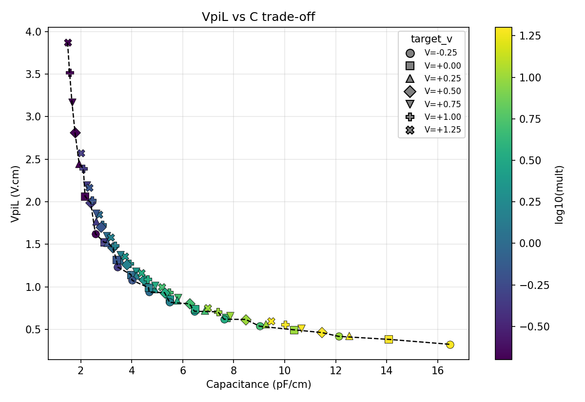
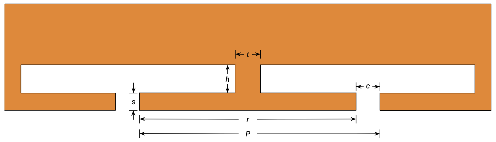
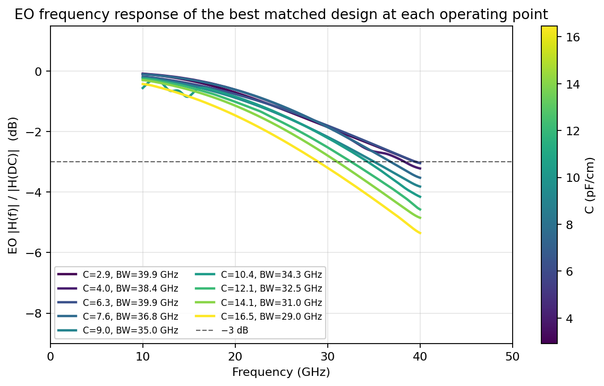

# Designing Ten Modulators Overnight: A Multi-Physics Agent in the Loop

An autonomous design agent ran four coupled physics simulations (charge transport, optical mode, 3-D RF FDTD, and an analytic loaded-line assembly) in one closed loop and produced ten silicon Mach–Zehnder modulators, each at a different point on the bandwidth-vs-efficiency frontier. Prior agentic demonstrations on this platform exercised one solver at a time. This run coordinates four in a single overnight session.

The headline result is the bandwidth-vs-efficiency curve traced out by ten fully optimized devices:

## Why a multi-physics agent

The two MZM datasheet numbers (bandwidth and VπL) depend on a chain of four physics: charge transport sets junction C(V) and R(V); optical mode solving sets VπL and loss; 3-D RF FDTD sets characteristic impedance Z0, RF group index neff,RF, and electrode losses; and an analytic loaded-line assembly folds all of these into an EO 3-dB bandwidth at a chosen device length and extinction ratio. Earlier blogs covered these solvers individually ([RF lines](https://hs.flexcompute.com/blog/rf-transmission-modulators), [junction envelope](https://hs.flexcompute.com/blog/agentic-photonic-design-modulators), [routing](https://hs.flexcompute.com/blog/agentic-photonic-design-routing)). The new piece is that all four live in the same loop, with the agent moving artifacts between them and keeping the geometry consistent.

## The loop

Two stacked loops share one journal.

**Step 1 (junction envelope).** A scalar `mult` scales p- and n-core doping around the process nominals (p = 5×1017, n = 3×1017 cm−3 at `mult = 1`). The agent walks a bracket-and-fill schedule with anchors at `mult ∈ {0.2, 1, 5, 20}`, inserting new mults at the largest gap on the (VπL, C) frontier. Each mult costs one Tidy3D Charge run plus a mode-solver batch over nine bias points; ten mults cover the cloud:

**Step 2 (electrode per operating point).** From the Step-1 journal, pick ten capacitance values linearly spaced across the range and, for each, take the row with minimum VπL within ±10 % of that C. Then run an 8-parameter Bayesian optimization on the segmented coplanar-strip electrode (inner gap `g`, rail widths `ws`/`wg`, T-bar `s`/`r`, neck `h`/`t`, period gap `c`):

The objective maximizes the analytic 3-dB EO bandwidth, computed by closed-form loaded-line and transfer-function arithmetic. Junction loading is applied *after* the FDTD via analytic ABCD on the cached Tidy3D S-parameters and the per-V (C, R) record from Step 1.

## DRC, generalized

Following the framing from the [routing blog](https://hs.flexcompute.com/blog/agentic-photonic-design-routing), any rule the computer can check (geometric or physical) is a design-rule check. Before billing a cloud simulation the agent enforces three layers: **fab rules** (the 8-parameter box bounds; out-of-box BO proposals are rejected at no cost); **process rules** (heavy contact dopings, waveguide dimensions, and the dielectric stack are frozen); and **setup sanity**: a 300 μm minimum feedline so the wave port stays ≥2 mesh cells off PML, a sign-flip retry on the de-embedded RF group index (one candidate returned neff = −3.01 and auto-retried with ±2 % perturbation), and a 1.2 GHz Gaussian smoother on the extracted H(f) that caught single-frequency ripples that would otherwise have produced spurious −3 dB crossings a few GHz off.

## What the agent found

Nine distinct designs (operating point 8 picked the same junction as operating point 7), sorted by efficiency:

| C [pF/cm] | VπL [V·cm] | 1/VπL [(V·cm)⁻¹] | LMZM [μm] | Z0,loaded [Ω] | neff,RF | BW3dB [GHz] |
|---:|---:|---:|---:|---:|---:|---:|
| 2.92 | 1.523 | 0.66 | 1325 | 52.2 | 3.79 | **39.9** |
| 4.01 | 1.078 | 0.93 | 937 | 54.1 | 4.40 | 38.4 |
| 6.27 | 0.800 | 1.25 | 696 | 49.2 | 5.75 | **39.9** |
| 7.62 | 0.619 | 1.61 | 538 | 54.9 | 6.67 | 36.8 |
| 9.02 | 0.537 | 1.86 | 467 | 51.0 | 7.16 | 35.1 |
| 10.35 | 0.495 | 2.02 | 430 | 52.2 | 8.24 | 34.3 |
| 12.11 | 0.418 | 2.39 | 363 | 53.0 | 9.40 | 32.5 |
| 14.07 | 0.383 | 2.61 | 333 | 52.6 | 10.71 | 31.0 |
| 16.47 | 0.324 | 3.08 | 282 | 49.1 | 11.35 | 29.0 |

Across all ten operating points the electrode holds Z0,loaded within ±10 % of 50 Ω. At light loading (C < 5 pF/cm) neff,RF lands at 3.8–4.4, well-matched to the 3.88 optical group index, and bandwidth reaches 38–40 GHz on a 0.9–1.3 mm device. At heavy loading (C > 7 pF/cm) the junction's loaded shunt forces neff,RF up to 7–11; bandwidth lands at 29–37 GHz with device length below 540 μm. The bandwidth degrades smoothly with loading, set primarily by velocity walk-off and the junction's intrinsic R·C pole, not by impedance mismatch.

## What was unexpected

- **The agent offered to optimize bandwidth directly.** Halfway through the run, it proposed switching the objective from `((Z₀−50)/50)² + ((n_eff−3.88)/3.88)²` to maximizing the analytic 3-dB BW directly. The pivot added +5 to +11 GHz across the heavy-loading half of the curve.
- **Cross-evaluation across operating points was free.** A single CPS FDTD result depends only on geometry; junction loading is applied analytically afterwards. So every FDTD gave ten data points (one per c_target). 16 hand-picked FDTDs across two design-of-experiments rounds, cross-evaluated, covered the search corners for all ten operating points.
- **One FDTD glitch nearly cost a result.** At C = 12.11 pF/cm a single-frequency γ(f) ripple put a spurious 1-dB dip in H(f) at 22 GHz; the smoothing kernel caught it.

## What makes this different from a parameter sweep

1. **Four physics in one agent's working memory.** The same context that proposed the electrode geometry also picked the Step-1 row, applied the analytic loading, and decided whether the bandwidth was worth the next FDTD. The journal is the only persistent state.
2. **Analysis first, simulation second.** Before billing each FDTD batch the agent worked the data already in hand. It cross-evaluated every cached geometry against every operating point's junction (free, no cloud spend), derived the (Z0, neff) Pareto slope analytically from the loaded-line equations, and computed an neff floor per c_target from the junction RC time constant. Each of the 16 hand-picked FDTDs in the BW-optimization phase was paired with an explicit physics hypothesis. A blind BO would have spent multiples of the cloud credit chasing the same answer.
3. **The result is a frontier, not a point.** A device designer picks one modulator off the table; a process engineer reruns the loop on new design rules and re-reads the envelope.

The pattern extends to thermo-optic phase shifters, electro-absorption modulators, ring resonators with active tuning, and any other device whose figure of merit stacks two or more physics solvers on the same geometry.

## Further reading

- [Agentic photonic design: silicon microring modulators](https://hs.flexcompute.com/blog/agentic-photonic-design-modulators)
- [Agentic photonic design: routing under DRC](https://hs.flexcompute.com/blog/agentic-photonic-design-routing)
- [Autonomous RF transmission-line design](https://hs.flexcompute.com/blog/rf-transmission-modulators)
